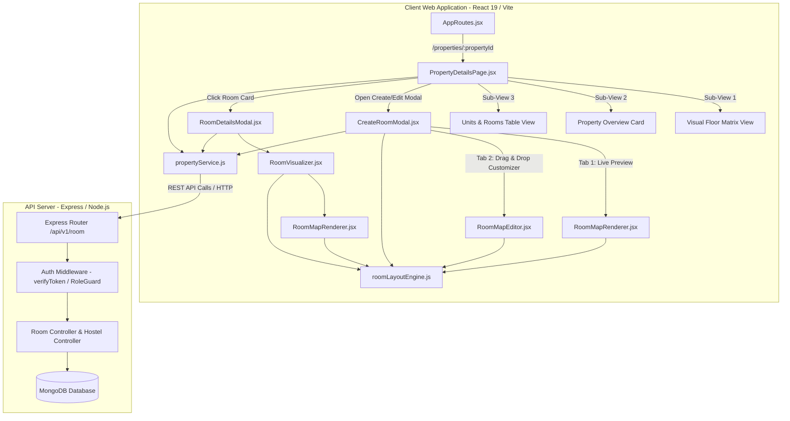

# Complete Master Architectural Documentation: Nestify 2D Room Blueprint & Bed Mapping Engine

---

## 1. System Architecture Overview

The **Nestify 2D Room Blueprint & Bed Mapping Engine** is an architectural top-down floor plan design and RedBus-style bed allocation system. It bridges backend REST API endpoints and MongoDB document models with an interactive vector SVG frontend interface.



---

## 2. Frontend Routing & Page Drill-Down Architecture

### 2.1 Route Map ([AppRoutes.jsx](file:///d:/Project/hostel_projects/nestify_client_web/src/routes/AppRoutes.jsx))

| Route Path | Allowed Roles | Component | Description |
| :--- | :--- | :--- | :--- |
| **`/admin/properties`** | `SUPER_ADMIN` | `PropertiesUnitsPage.jsx` | Super Admin properties directory without dropdowns. Shows property cards with occupancy metrics. |
| **`/admin/properties/:propertyId`** | `SUPER_ADMIN` | `PropertyDetailsPage.jsx` | Complete drill-down hub for a single property with Floor Matrix, Overview, and Units Table. |
| **`/tenant/properties`** | `TENANT` | `PropertiesUnitsPage.jsx` | Property manager's hostels/properties directory. |
| **`/tenant/properties/:propertyId`** | `TENANT` | `PropertyDetailsPage.jsx` | Property manager's drill-down hub for room/bed management. |
| **`/tenant/rooms/:propertyId`** | `TENANT` | `PropertyDetailsPage.jsx` | Direct alias to room visual matrix. |
| **`/tenant/beds/:propertyId`** | `TENANT` | `PropertyDetailsPage.jsx` | Direct alias to bed inventory roster. |

---

### 2.2 Property Details Page Layout ([PropertyDetailsPage.jsx](file:///d:/Project/hostel_projects/nestify_client_web/src/pages/admin/PropertyDetailsPage.jsx))

The hub is divided into 3 responsive views:
1. **Visual Floor Matrix (`matrix`)**: Grouped by floor numbers (`Floor 1`, `Floor 2`, etc.). Displays visual room cards with live mini architectural floor plan previews, occupancy meters, sharing badges, and quick actions.
2. **Property Overview Card (`overview`)**: Displays property metadata, location, full address, sharing type breakdown, contact details, total capacity, and amenity tags.
3. **Units & Rooms Table (`table`)**: High-density operational data table with column sorting, occupancy search, status filters, and instant action buttons (**Inspect**, **Edit**, **Delete**).

---

## 3. Frontend Component Hierarchy & Data Flow

```
src/
├── pages/admin/
│   ├── PropertiesUnitsPage.jsx      # Top-level property cards directory
│   └── PropertyDetailsPage.jsx      # Drill-down hub with Floor Matrix, Overview & Table
├── components/properties/
│   ├── CreateRoomModal.jsx          # Room Creator & Editor with Real-time Blueprint
│   ├── RoomDetailsModal.jsx         # Room Inspection Modal with Bed Inventory Roster
│   ├── RoomVisualizer.jsx           # RedBus-style Bed Selector & Action Drawer
│   ├── RoomMapRenderer.jsx          # Pure Vector SVG Architectural Canvas
│   └── RoomMapEditor.jsx            # Drag-and-Drop Coordinate & Rotation Customizer
├── services/
│   └── propertyService.js           # API integration layer with optimistic local cache
└── utils/
    └── roomLayoutEngine.js          # Mathematical layout geometry, normalization & clamping
```

### Component Responsibility Breakdown:

#### 1. [`CreateRoomModal.jsx`](file:///d:/Project/hostel_projects/nestify_client_web/src/components/properties/CreateRoomModal.jsx)
* **Tabs**:
  * **Tab 1 (Preview)**: Real-time architectural blueprint map preview that updates live as the user toggles facilities (AC, TV, Attached Bath, Window, Lockers, Study Desk) or changes sharing capacity.
  * **Tab 2 (Interactive Map Editor)**: Canvas where admins drag objects, rotate beds/fixtures in 90° increments, and select bed dimensions.
* **Outputs**: Dispatches sanitized `payload` (metadata + `layout` object) to `onSaveRoom`.

#### 2. [`RoomMapEditor.jsx`](file:///d:/Project/hostel_projects/nestify_client_web/src/components/properties/RoomMapEditor.jsx)
* Converts screen pointer/touch coordinates to SVG canvas space via `getScreenCTM().inverse()`.
* Automatically clamps elements within room walls using [`clampElementWithinBounds()`](file:///d:/Project/hostel_projects/nestify_client_web/src/utils/roomLayoutEngine.js).
* Provides an interactive property inspector for the selected object (Bed Size picker, Locker Doors count `1..8`, Rotate 90°, and Delete).

#### 3. [`RoomMapRenderer.jsx`](file:///d:/Project/hostel_projects/nestify_client_web/src/components/properties/RoomMapRenderer.jsx)
* Reads `layout.dimensions` and `layout.elements` and renders SVG vector graphics with:
  * Textured floor tile pattern (`floor-tile-pattern`).
  * Tiled wet area pattern for bathrooms (`bath-tile-pattern`).
  * Wooden grain gradients for lockers and desks (`wood-cabinet-gradient`).
  * Mattress gradient with stitched pillow and folded bed runner.
  * Color-coded bed status badges (**Available**, **Occupied**, **Reserved**, **Maintenance**) and resident names.

#### 4. [`RoomVisualizer.jsx`](file:///d:/Project/hostel_projects/nestify_client_web/src/components/properties/RoomVisualizer.jsx)
* Wraps `RoomMapRenderer` for RedBus-style seat selection.
* Clicking any bed opens the **Selected Bed Action Drawer**, revealing resident details, monthly rent, and direct **Allocate Bed** triggers.

#### 5. [`roomLayoutEngine.js`](file:///d:/Project/hostel_projects/nestify_client_web/src/utils/roomLayoutEngine.js)
* Core algorithmic engine that calculates corridor widths, spaces beds evenly, normalizes legacy data, and guarantees non-overlapping fixture coordinates.

---

## 4. Backend REST API Architecture & Endpoints

Base URL: `http://localhost:5000` (configurable via `VITE_API_BASE_URL`).

### 4.1 `GET /api/v1/room?hostelId={hostelId}`
* **Headers**: `Authorization: Bearer <accessToken>` or session cookie.
* **Success Response (`200 OK`)**:
```json
{
  "success": true,
  "data": {
    "rooms": [
      {
        "_id": "6ac72e2d75b6a56fe208a268",
        "hostelId": "6ac72e2d75b6a56fe208a263",
        "floorNumber": 1,
        "floorName": "Ground Floor (Floor 1)",
        "roomNumber": "102",
        "roomType": "double",
        "capacity": 2,
        "monthlyRent": 8500,
        "facilities": {
          "hasAc": true,
          "hasTv": true,
          "hasAttachedWashroom": true,
          "hasBalcony": false,
          "hasWindow": true,
          "hasCupboard": true,
          "hasStudyTable": true,
          "hasGeyser": true,
          "hasWifi": true
        },
        "hasAc": true,
        "washroomType": "attached",
        "beds": [
          {
            "_id": "6ac72e2d75b6a56fe208a269",
            "bedNumber": "102-A",
            "isOccupied": false,
            "status": "available",
            "monthlyRent": 8500,
            "residentId": null
          },
          {
            "_id": "6ac72e2d75b6a56fe208a26a",
            "bedNumber": "102-B",
            "isOccupied": true,
            "status": "occupied",
            "monthlyRent": 8500,
            "residentId": {
              "_id": "usr_789",
              "name": "Rahul Sharma",
              "phone": "+91 9876543210"
            }
          }
        ],
        "layout": {
          "version": "2.0",
          "dimensions": { "width": 920, "height": 540, "wallThickness": 22, "scaleUnit": "px" },
          "elements": [
            { "id": "el_lockers_102", "type": "lockers", "x": 30, "y": 28, "width": 130, "height": 85, "doors": 4, "rotation": 0 },
            { "id": "el_bath_102", "type": "bathroom", "x": 732, "y": 28, "width": 160, "height": 175, "rotation": 0 },
            { "id": "el_bed_102_A", "type": "bed", "bedNumber": "102-A", "x": 104, "y": 182, "width": 82, "height": 180, "rotation": 0 },
            { "id": "el_bed_102_B", "type": "bed", "bedNumber": "102-B", "x": 225, "y": 182, "width": 82, "height": 180, "rotation": 0 },
            { "id": "el_desk_102", "type": "studyDesk", "x": 34, "y": 465, "width": 65, "height": 40, "rotation": 0 }
          ]
        },
        "status": "active"
      }
    ]
  }
}
```

---

### 4.2 `POST /api/v1/room`
* **Request Payload**:
```json
{
  "hostelId": "6ac72e2d75b6a56fe208a263",
  "floorNumber": 1,
  "floorName": "Ground Floor (Floor 1)",
  "roomNumber": "103",
  "roomType": "double",
  "capacity": 2,
  "monthlyRent": 8500,
  "facilities": {
    "hasAc": true,
    "hasTv": true,
    "hasAttachedWashroom": true,
    "hasBalcony": false,
    "hasWindow": true,
    "hasCupboard": true,
    "hasStudyTable": true
  },
  "layout": {
    "version": "2.0",
    "dimensions": { "width": 920, "height": 540, "wallThickness": 22 },
    "elements": [ /* Array of 2D Vector Elements */ ]
  }
}
```
* **Response (`201 Created`)**: Returns the newly created room document with auto-initialized `beds` array.

---

### 4.3 `PUT /api/v1/room/:roomId`
* **Request Payload**: Modified room fields, facilities, updated rent, and updated `layout` object with customized coordinates.
* **Response (`200 OK`)**: Returns updated room document.

---

### 4.4 `PATCH /api/v1/room/:roomId/beds/:bedNumber`
* **Request Payload**:
```json
{
  "isOccupied": true,
  "status": "occupied",
  "residentId": "6ac72e2d75b6a56fe208a301",
  "monthlyRent": 8500
}
```
* **Response (`200 OK`)**: Updates the embedded bed sub-document in MongoDB.

---

## 5. Mongoose Data Schema ([nestify_api_server])

```javascript
import mongoose from 'mongoose';

const BedSchema = new mongoose.Schema({
  bedNumber: { type: String, required: true, trim: true },
  isOccupied: { type: Boolean, default: false },
  residentId: { type: mongoose.Schema.Types.ObjectId, ref: 'User', default: null },
  status: {
    type: String,
    enum: ['available', 'occupied', 'reserved', 'maintenance'],
    default: 'available',
  },
  monthlyRent: { type: Number, required: true, min: 0 },
  occupiedAt: { type: Date, default: null },
});

const RoomSchema = new mongoose.Schema(
  {
    hostelId: { type: mongoose.Schema.Types.ObjectId, ref: 'Hostel', required: true, index: true },
    floorNumber: { type: Number, required: true, min: 0 },
    floorName: { type: String, required: true },
    roomNumber: { type: String, required: true, trim: true },
    roomType: {
      type: String,
      enum: ['single', 'double', 'triple', 'four_sharing', 'five_sharing', 'dormitory'],
      required: true,
    },
    capacity: { type: Number, required: true, min: 1 },
    monthlyRent: { type: Number, required: true, min: 0 },
    facilities: {
      hasAc: { type: Boolean, default: false },
      hasTv: { type: Boolean, default: true },
      hasAttachedWashroom: { type: Boolean, default: true },
      hasBalcony: { type: Boolean, default: false },
      hasWindow: { type: Boolean, default: true },
      hasCupboard: { type: Boolean, default: true },
      hasStudyTable: { type: Boolean, default: false },
      hasGeyser: { type: Boolean, default: true },
      hasWifi: { type: Boolean, default: true },
    },
    hasAc: { type: Boolean, default: false },
    washroomType: { type: String, enum: ['attached', 'common'], default: 'attached' },
    beds: [BedSchema],
    layout: { type: mongoose.Schema.Types.Mixed, default: null },
    status: { type: String, enum: ['active', 'maintenance', 'inactive'], default: 'active' },
    photos: [{ type: String }],
  },
  { timestamps: true }
);

RoomSchema.index({ hostelId: 1, roomNumber: 1 }, { unique: true });

export default mongoose.model('Room', RoomSchema);
```

---

## 6. Comprehensive Field-by-Field Key Dictionary

### 6.1 Top-Level Room Keys

| Key | Type | Example | Purpose & Business Logic |
| :--- | :--- | :--- | :--- |
| **`_id`** | `ObjectId` | `"6ac72e2d75b6a56fe208a268"` | Primary MongoDB document ID for CRUD operations. |
| **`hostelId`** | `ObjectId` | `"6ac72e2d75b6a56fe208a263"` | Parent hostel reference for tenancy scoping and security isolation. |
| **`floorNumber`** | `Number` | `1` | Integer floor index for sorting and grouping floor matrices. |
| **`floorName`** | `String` | `"Ground Floor (Floor 1)"` | Display label for floor headers. |
| **`roomNumber`** | `String` | `"102"` | Room label; acts as prefix for generated bed names (`102-A`). |
| **`roomType`** | `String` | `"double"` | Sharing type enum. Triggers automatic capacity defaults and bed geometry. |
| **`capacity`** | `Number` | `2` | Bed capacity. Controls the size of the `beds[]` roster and layout synthesis. |
| **`monthlyRent`** | `Number` | `8500` | Default monthly rent in ₹ per bed for tenant checkout and invoicing. |
| **`facilities`** | `Object` | `{ hasAc: true, ... }` | Amenities map determining which fixtures are visible on the map. |
| **`hasAc`** | `Boolean` | `true` | Top-level query flag for AC room filtering. |
| **`washroomType`**| `String` | `"attached"` | `'attached'` renders enclosed bathroom compartment; `'common'` hides it. |
| **`beds`** | `Array<Bed>` | `[...]` | Embedded array of bed records driving the RedBus allocation system. |
| **`layout`** | `Object` | `{ dimensions, elements }`| Version 2.0 Vector 2D floor plan blueprint schema. |
| **`status`** | `String` | `"active"` | Operational status (`'active'`, `'maintenance'`, `'inactive'`). |

---

### 6.2 Layout Dimensions Keys (`layout.dimensions`)

| Key | Type | Default | Purpose |
| :--- | :--- | :--- | :--- |
| **`width`** | `Number` | `920` | SVG canvas viewBox coordinate width. |
| **`height`** | `Number` | `540` | SVG canvas viewBox coordinate height. |
| **`wallThickness`** | `Number` | `22` | Solid boundary wall thickness in pixels. |
| **`scaleUnit`** | `String` | `'px'` | Coordinate unit specifier. |

---

### 6.3 Layout Elements Keys (`layout.elements[i]`)

| Key | Type | Example | Purpose |
| :--- | :--- | :--- | :--- |
| **`id`** | `String` | `"el_desk_102_2"` | Clean room-based unique element identifier. |
| **`type`** | `String` | `'bed'`, `'lockers'`, `'bathroom'`, `'ac'`, `'tv'`, `'window'`, `'door'`, `'studyDesk'` | Fixture type determining the SVG rendering template. |
| **`label`** | `String` | `"Study Desk 2"` | Primary label displayed on the canvas. |
| **`sublabel`** | `String` | `"5 Compartments"` | Spec subtitle (e.g. `"Split Inverter"`, `"Sliding Glass"`). |
| **`x`** | `Number` | `122` | Left horizontal coordinate on the 920px canvas. |
| **`y`** | `Number` | `459` | Top vertical coordinate on the 540px canvas. |
| **`width`** | `Number` | `65` | Width of the fixture bounding box in pixels. |
| **`height`** | `Number` | `40` | Height of the fixture bounding box in pixels. |
| **`rotation`** | `Number` | `0`, `90`, `180`, `270` | Clockwise rotation angle for wall alignment. |
| **`doors`** | `Number` | `4` | Number of locker compartments (1 to 8). |
| **`fixtures`** | `Array<String>` | `["commode", "shower", "sink"]` | Sub-fixtures inside the bathroom. |
| **`bedNumber`** | `String` | `"102-A"` | Bed number binding vector bed to data record in `beds[]`. |
| **`bedType`** | `String` | `'single'`, `'twin'`, `'double'`, `'queen'`, `'bunk'` | Furniture size configuration. |
| **`hasChair`** | `Boolean` | `true` | Renders swivel desk chair when true. |

---

## 7. Vector Coordinate Math & Algorithmic Geometry

### 7.1 Bed Matrix Calculation
Available bed corridor width:
$$\text{usableWidth} = (\text{width} - \text{wall} - 190) - (\text{wall} + 36)$$

For $N$ beds ($N \le 4$):
$$\text{gap} = \frac{\text{usableWidth} - (N \times \text{bedWidth})}{N + 1}$$
$$X_i = \text{startX} + \text{gap} + i \times (\text{bedWidth} + \text{gap})$$
$$Y_i = \text{wall} + 160\text{px}$$

### 7.2 Boundary Clamping Algorithm
$$\text{clampedX} = \max(\text{wall} + 4, \min(\text{width} - \text{wall} - \text{el.width} - 4, \text{el.x}))$$
$$\text{clampedY} = \max(\text{wall} + 4, \min(\text{height} - \text{wall} - \text{el.height} - 4, \text{el.y}))$$

---

## 8. Data Migration & Cache Strategy

1. **Dual Caching Layer**:
   * API responses are cached in `localStorage` under `pgh_rooms_{hostelId}`.
   * [`getPropertyRooms()`](file:///d:/Project/hostel_projects/nestify_client_web/src/services/propertyService.js) merges fresh server records with locally customized layout coordinates, ensuring custom layouts are never lost even if a backend instance returns an unpopulated layout schema.
2. **Legacy Format Detection**:
   * [`normalizeLayout()`](file:///d:/Project/hostel_projects/nestify_client_web/src/utils/roomLayoutEngine.js) detects legacy `row/col` structures (`maxX < 50` or `bed.width < 40`) and maps every item into its proper architectural position.
